# shinyCLT: Central Limit Theorem Interactive Demonstration

An interactive Shiny application to explore the **Central Limit Theorem (CLT)** through simulations. This app is designed for students and educators to visualise how sample means behave across different distributions.

---

## Installation

Open RStudio and run:

```r
# Install devtools if needed
install.packages("devtools")
install.packages("shiny")

# Install from GitHub
devtools::install_github("shinyCLT/shinyCLT", build_vignettes = TRUE)
```

### Step 3: Launch the application

```r
library(shinyCLT)
CLT()
```

A window will open in your web browser with the interactive application.

---

## How to Use the Application
### Basic Interface Overview

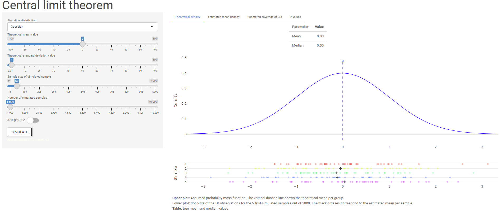
*The app has a sidebar (left) for settings and a main panel (right) for visualisations.*

The application has **TWO MODES**:

- **One Group Mode** Explore one population
- **Two Groups Mode** Compare two populations

---

## One Group Mode (Single Population)

Use this mode to understand how the Central Limit Theorem works with a single population.

### Choose a Distribution

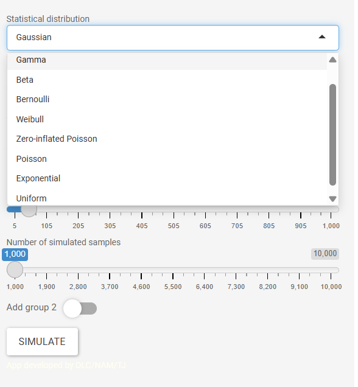

In the **sidebar**, select a **distribution** from the dropdown menu:

- **Gaussian (Normal)** The classic bell curve
- **Gamma** Skewed distribution (always positive values)
- **Beta** Bounded between 0 and 1
- **Bernoulli** Coin flip (0 or 1, success/failure)
- **Weibull** Often used for lifetimes/survival data
- **Zero-inflated Poisson** Count data with many zeros
- **Poisson** Count data (e.g., number of events)
- **Exponential** Time between events
- **Uniform** All values equally likely

### Set Simulation Parameters

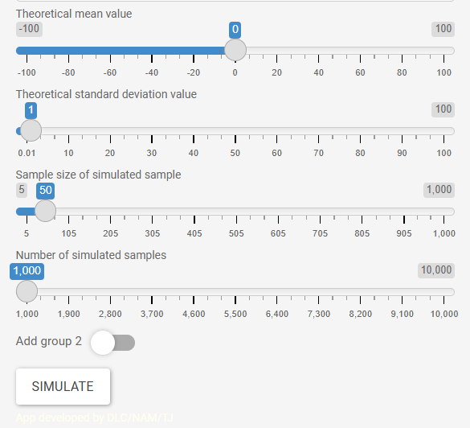

Depending on your distribution, you'll see sliders to adjust:

- **Theoretical mean (μ)**
- **Theoretical standard deviation (σ)** (not available for all distributions)
- **Sample size (n)**
- **Number of simulations (R)**

### Run the Simulation

Click the **"Simulate"** button!

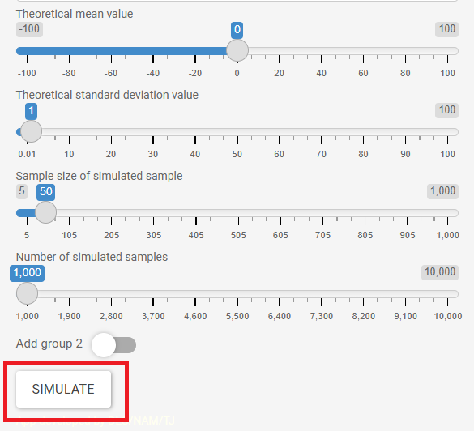

**Important:** The simulation only runs when you click "Simulate". If you change any settings, you must click "Simulate" again to see updated results.

### Explore the Results

 The app has **4 tabs** with different visualisations.

Each tab has helpful explanatory **text at the bottom**; scroll down to read detailed information about plots and tables.

#### Tab 1: Theoretical density

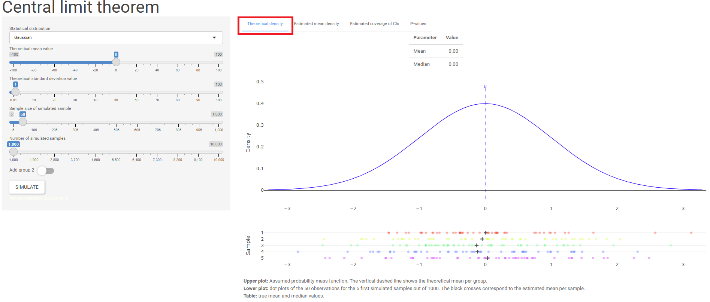

**Top plot** *(interactive - hover to explore)*
- Blue line: The original population distribution
- Blue dashed line: theoretical mean (μ)

**Bottom plot** *(interactive - hover to explore)*
- Raw values from the first 5 samples

#### Tab 2: Estimated mean density

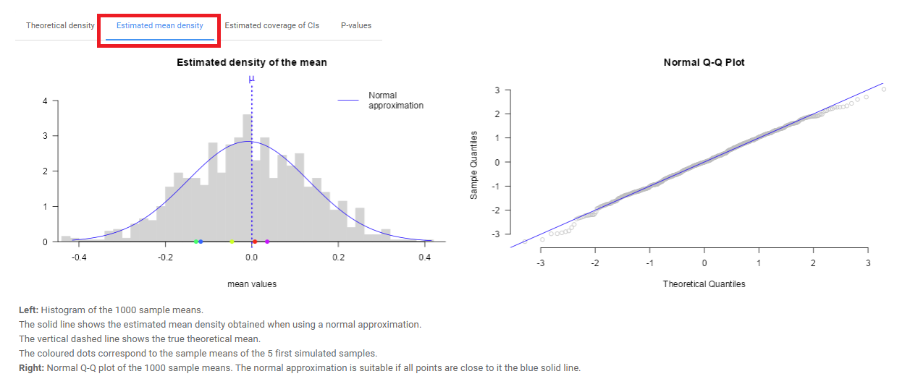

- A density plot showing how the sample means are distributed
- Q-Q plot to check if the distribution is approximately normal

#### Tab 3: Estimated Coverage of CIs

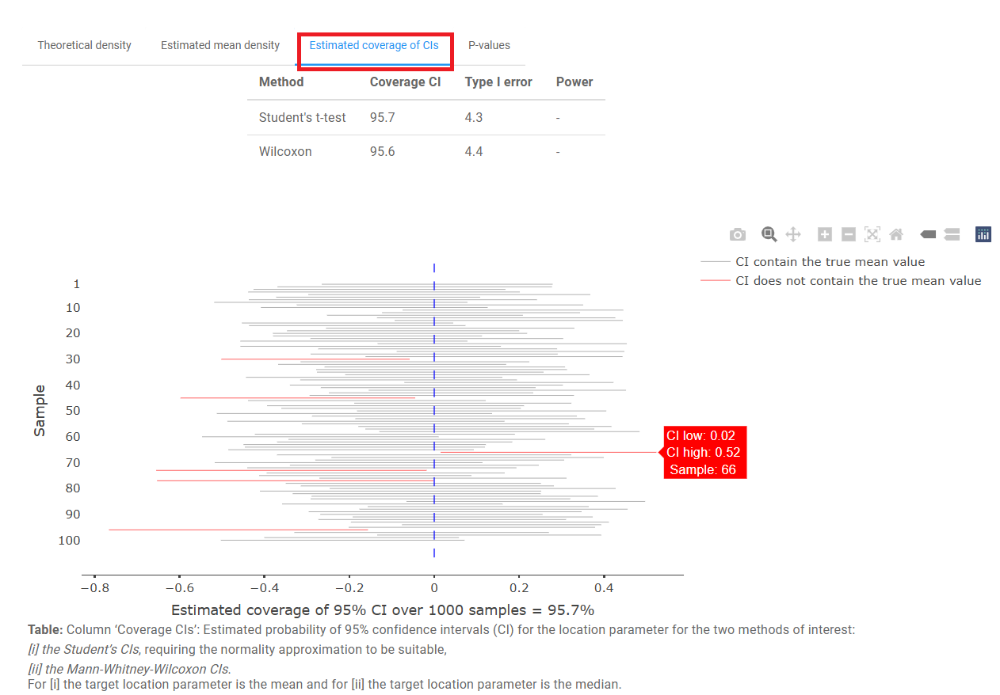

###### *Loading of this tab could take some time*

**Table**
Shows the **estimated coverage** of confidence intervals, **Type I error rate**, and **statistical power**
  - **Coverage** Percentage of CIs that contain the true mean
  - **Type I error** Percentage of false positives when testing if the mean differs from the true value
  - **Power** Ability to detect a real difference when one exists
  
**Plot** *(interactive - hover to explore)*
Blue dashed line is the true mean (μ)
Horizontal lines representing confidence intervals for the first 100 samples:
  - **Grey** interval contains the true mean
  - **Red** interval misses the true mean

#### Tab 4: P-values

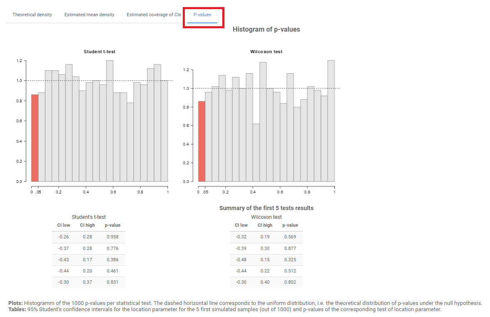

 **Top Histograms** of p-values from statistical tests
 **Bottom Tables** showing results for the first 5 samples

---

## Two Groups Mode (Comparing Populations)

Use this mode to compare two populations.

### Enable Two Groups Mode

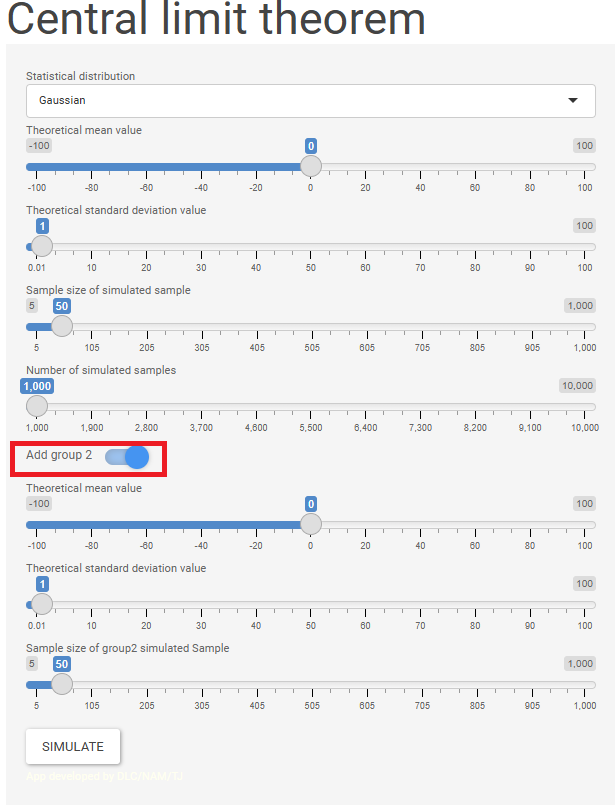

In the left sidebar, toggle the **"Add group 2"** switch to ON.

You'll now see sliders for:
- **Group 1** (top) First population parameters
- **Group 2** (bottom) Second population parameters

Click **"Simulate"** to run the two-group simulation.

---
### Explore the Results
#### Tab 1: Theoretical densities

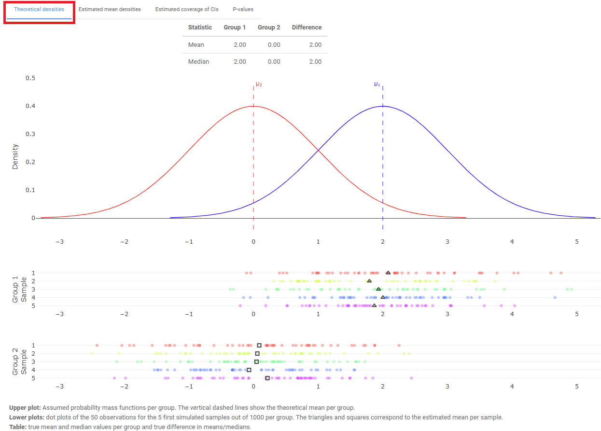

**Top plot** *(interactive - hover to explore)*
- Distributions shown for Group 1 in blue colour and Group 2 in red
- Theoretical means (μ) of distributions depicted by dashed lines

**Bottom plots** *(interactive - hover to explore)*
- Raw values from the first 5 samples for Group 1 and Group 2

#### Tab 2: Estimated mean densities

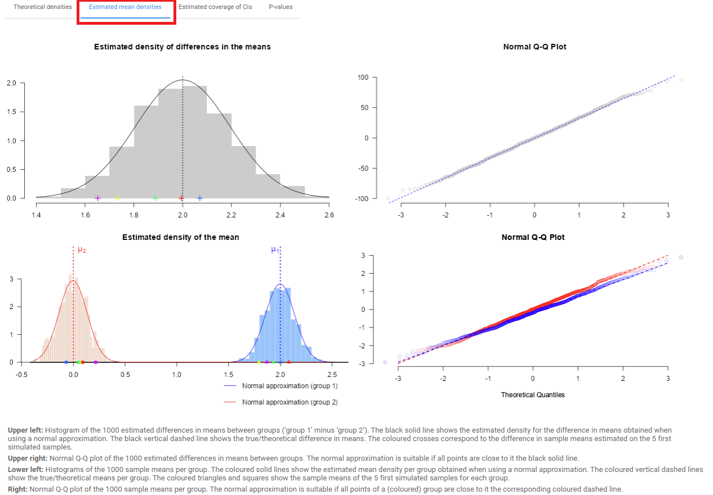

**Upper left plot**
- Histogram of the estimated differences in means between groups (Group 1 minus Group 2)
- Black solid line shows the estimated density using normal approximation
- Black vertical dashed line shows the true/theoretical difference in means
- Coloured crosses show the difference in sample means from the first 5 samples

**Upper right plot**
- Normal Q-Q plot of the estimated differences in means between groups
- Points close to the black solid line indicate normal distribution

**Lower left plot**
- Histograms of the sample means per group
- Coloured solid lines show the estimated mean density per group using normal approximation
- Coloured vertical dashed lines show the true/theoretical means per group
- Coloured triangles and squares show the sample means of the first 5 samples for each group

**Lower right plot**
- Normal Q-Q plot of the sample means per group
- Points close to the corresponding coloured dashed line indicate normal distribution for each group

#### Tab 3: Estimated coverage of CIs

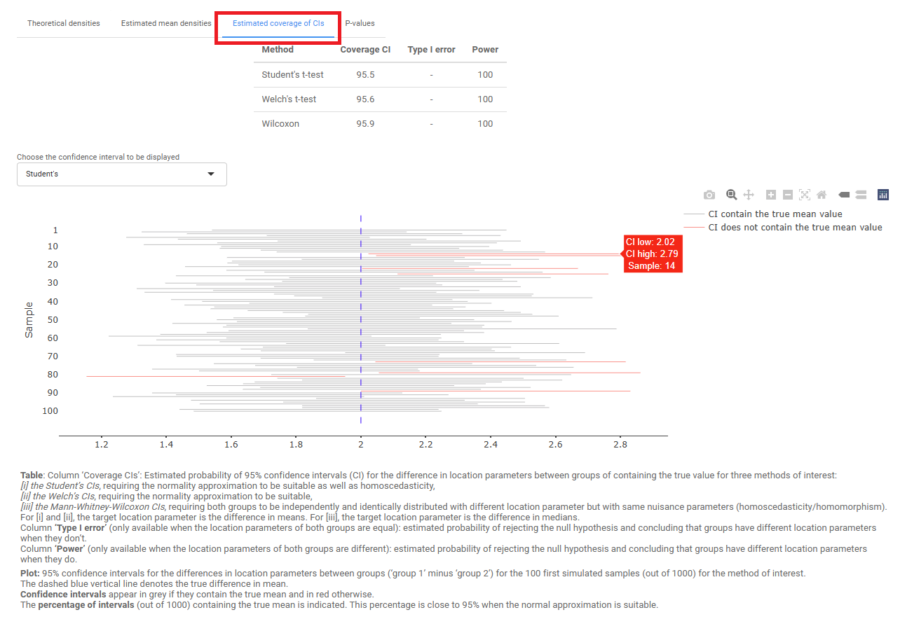

**Table**
Summarises **confidence interval coverage**, **Type I error rate**, and statistical **power** for different tests
  - **Coverage**  Percentage of CIs that contain the true difference in means
  - **Type I error** Rate of false positives when groups are actually identical
  - **Power** Ability to detect a real difference between groups

**Test selection dropdown** you can choose between:
  - **Student's t-test** (assumes equal variances)
  - **Welch t-test** (does NOT assume equal variances)
  - **Wilcoxon test** (non-parametric)

**Plot** *(interactive - hover to explore)*:
- Visualisation of confidence intervals for the selected test

#### Tab 4: P-values Comparison

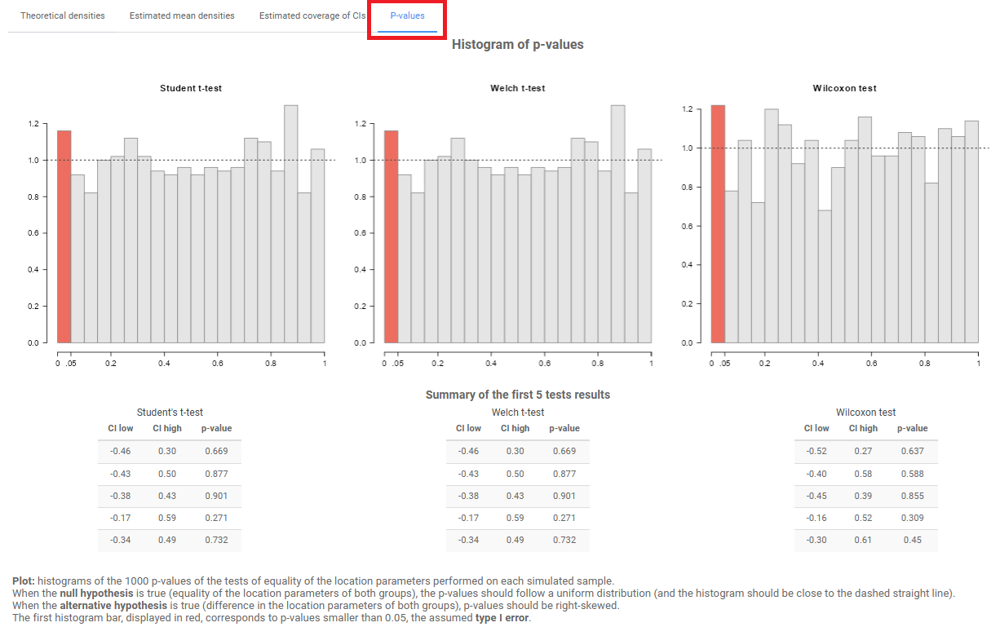

**Histograms**
P-values distribution across all simulations

**Tables**
Results for the first 5 samples for all three tests:
  - **Student's t-test**
  - **Welch t-test**
  - **Wilcoxon test**
---
## Other Notes

The simulations can take time (especially with R = 10000). Clicking "Simulate" prevents the app from recalculating while you're adjusting sliders.

**NA values in results** Some statistical tests fail with constant data. This is expected behaviour.

---
For more detailed information, see the package vignette:

```r
vignette("shinyCLT")
```
